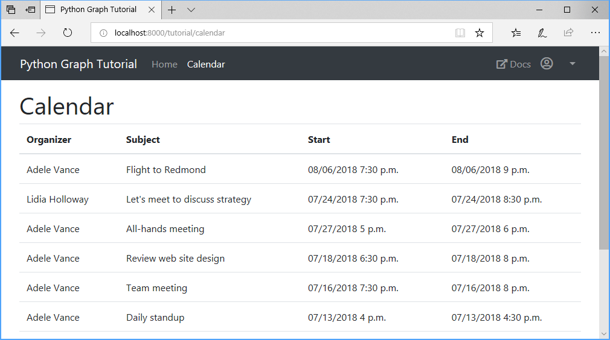

<!-- markdownlint-disable MD002 MD041 -->

En este ejercicio, incorporará Microsoft Graph a la aplicación. Para esta aplicación, usará la biblioteca reQuests [-OAuthlib](https://requests-oauthlib.readthedocs.io/en/latest/) para realizar llamadas a Microsoft Graph.

## <a name="get-calendar-events-from-outlook"></a>Obtener eventos de calendario de Outlook

Empiece agregando un método a `./tutorial/graph_helper.py` para capturar los eventos del calendario. Agregue el método siguiente.

```python
def get_calendar_events(token):
  graph_client = OAuth2Session(token=token)

  # Configure query parameters to
  # modify the results
  query_params = {
    '$select': 'subject,organizer,start,end',
    '$orderby': 'createdDateTime DESC'
  }

  # Send GET to /me/events
  events = graph_client.get('{0}/me/events'.format(graph_url), params=query_params)
  # Return the JSON result
  return events.json()
```

Tenga en cuenta lo que está haciendo este código.

- La dirección URL a la que se `/v1.0/me/events`llamará es.
- El `$select` parámetro limita los campos devueltos para cada evento a solo aquellos que la vista usará realmente.
- El `$orderby` parámetro ordena los resultados por la fecha y hora en que se crearon, con el elemento más reciente en primer lugar.

Ahora, cree una vista de calendario. En primer lugar `from tutorial.graph_helper import get_user` , cambie la línea por lo siguiente.

```python
from tutorial.graph_helper import get_user, get_calendar_events
```

A continuación, agregue la vista siguiente `./tutorial/views.py`a.

```python
def calendar(request):
  context = initialize_context(request)

  token = get_token(request)

  events = get_calendar_events(token)

  context['errors'] = [
    { 'message': 'Events', 'debug': format(events)}
  ]

  return render(request, 'tutorial/home.html', context)
```

Actualice `./tutorial/urls.py` para agregar esta nueva vista.

```python
path('calendar', views.calendar, name='calendar'),
```

Por último, actualice **** el vínculo de `./tutorial/templates/tutorial/layout.html` calendario en para vincular a esta vista. Reemplace la `<a class="nav-link active" href="#">Calendar</a>` línea por lo siguiente.

```html
<a class="nav-link active" href="">Calendar</a>
```

Ahora puede probar esto. Inicie sesión y haga clic en el vínculo de **calendario** en la barra de navegación. Si todo funciona, debería ver un volcado JSON de eventos en el calendario del usuario.

## <a name="display-the-results"></a>Mostrar los resultados

Ahora puede Agregar una plantilla para mostrar los resultados de forma más fácil de uso. Cree un nuevo archivo en el `./tutorial/templates/tutorial` directorio denominado `calendar.html` y agregue el siguiente código.

```html


<h1>Calendar</h1>
<table class="table">
  <thead>
    <tr>
      <th scope="col">Organizer</th>
      <th scope="col">Subject</th>
      <th scope="col">Start</th>
      <th scope="col">End</th>
    </tr>
  </thead>
  <tbody>
    
      
        <tr>
          <td>{{ event.organizer.emailAddress.name }}</td>
          <td>{{ event.subject }}</td>
          <td>{{ event.start.dateTime|date:'SHORT_DATETIME_FORMAT' }}</td>
          <td>{{ event.end.dateTime|date:'SHORT_DATETIME_FORMAT' }}</td>
        </tr>
      
    
  </tbody>
</table>

```

Se recorrerá en bucle una colección de eventos y se agregará una fila de tabla para cada uno. Agregue la siguiente `import` instrucción a la parte superior del `./tutorials/views.py` archivo.

```python
import dateutil.parser
```

Reemplace la `calendar` vista en `./tutorial/views.py` por el siguiente código.

```python
def calendar(request):
  context = initialize_context(request)

  token = get_token(request)

  events = get_calendar_events(token)

  if events:
    # Convert the ISO 8601 date times to a datetime object
    # This allows the Django template to format the value nicely
    for event in events['value']:
      event['start']['dateTime'] = dateutil.parser.parse(event['start']['dateTime'])
      event['end']['dateTime'] = dateutil.parser.parse(event['end']['dateTime'])

    context['events'] = events['value']

  return render(request, 'tutorial/calendar.html', context)
```

Actualice la página y la aplicación ahora debería representar una tabla de eventos.

