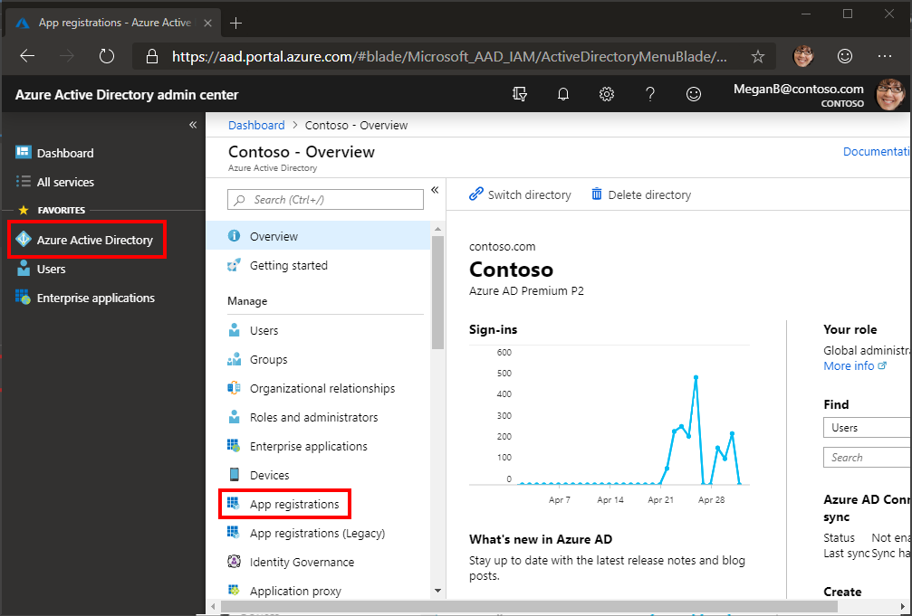
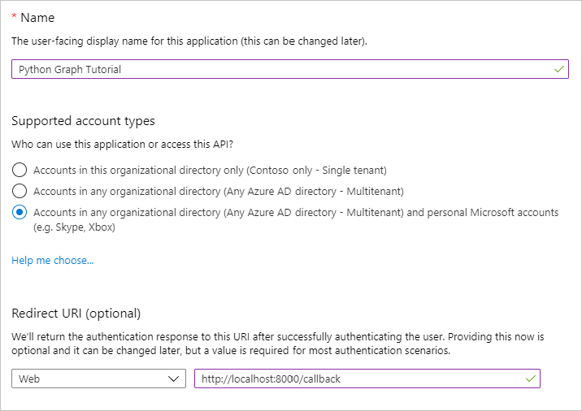
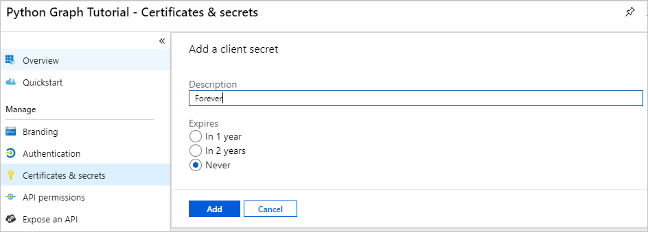

<!-- markdownlint-disable MD002 MD041 -->

En este ejercicio, creará un nuevo registro de aplicaciones Web de Azure AD con el centro de administración de Azure Active Directory.In this exercise, you will create a new Azure AD web application registration using the Azure Active Directory admin center.

1. Abra un explorador y vaya al [centro de administración de Azure Active Directory](https://aad.portal.azure.com).Open a browser and navigate to the [Azure Active Directory admin center](https://aad.portal.azure.com). Inicie sesión con una **cuenta personal** (también conocido como Microsoft Account) o una **cuenta profesional o educativa**.Login using a **personal account** (aka: Microsoft Account) or **Work or School Account**.

1. Seleccione **Azure Active Directory** en el panel de navegación de la izquierda y, después, seleccione **registros de aplicaciones (vista previa)** en **administrar**.Select **Azure Active Directory** in the left-hand navigation, then select **App registrations (Preview)** under **Manage**.

    

1. Seleccione **registro nuevo**.Select **New registration**. En la página **registrar una aplicación** , establezca los valores de la siguiente manera.On the **Register an application** page, set the values as follows.

    - Establezca **el nombre** en `Python Graph Tutorial`.Set **Name** to `Python Graph Tutorial`.
    - Establezca **tipos de cuenta compatibles** en **cuentas de cualquier directorio de la organización y cuentas personales de Microsoft**.Set **Supported account types** to **Accounts in any organizational directory and personal Microsoft accounts**.
    - En **URI**de redireccionamiento, establezca la primera lista desplegable para `Web` y establezca el `http://localhost:8000/tutorial/callback`valor en.Under **Redirect URI**, set the first drop-down to `Web` and set the value to `http://localhost:8000/tutorial/callback`.

    

1. Elija **registrar**.Choose **Register**. En la página **tutorial de Python Graph** , copie el valor del **identificador de la aplicación (cliente)** y guárdelo, lo necesitará en el paso siguiente.On the **Python Graph Tutorial** page, copy the value of the **Application (client) ID** and save it, you will need it in the next step.

    

1. Seleccione **certificados & secretos** en **administrar**.Select **Certificates & secrets** under **Manage**. Seleccione el botón **nuevo secreto de cliente** .Select the **New client secret** button. Escriba un valor en **Descripción** y seleccione una de las opciones para **Expires** y elija **Agregar**.Enter a value in **Description** and select one of the options for **Expires** and choose **Add**.

    

1. Copie el valor de secreto de cliente antes de salir de esta página.Copy the client secret value before you leave this page. Lo necesitará en el paso siguiente.You will need it in the next step.

    > [!IMPORTANT]
    > Este secreto de cliente no se vuelve a mostrar nunca, así que asegúrese de copiarlo ahora.This client secret is never shown again, so make sure you copy it now.

    